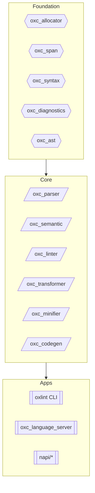
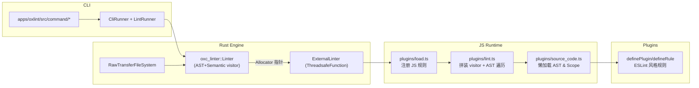
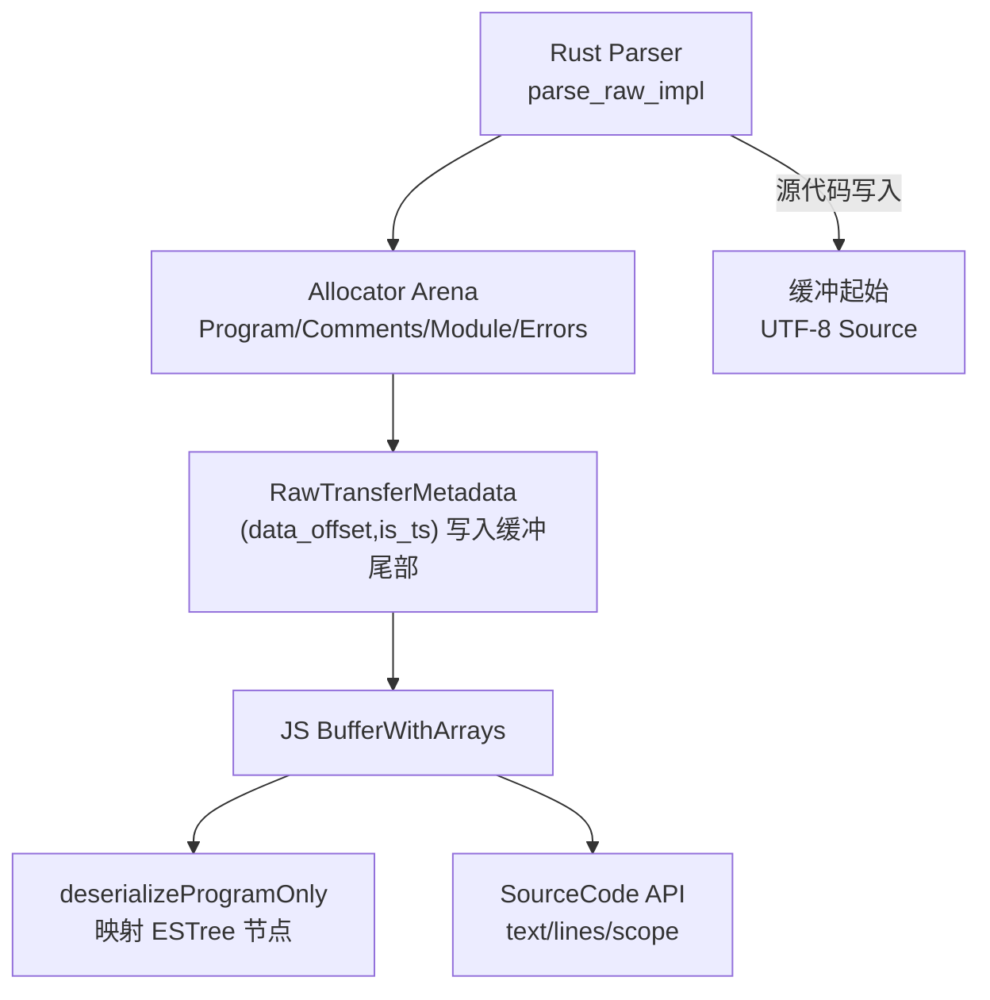

# 构建 ESLint 级别的 oxlint 能力

本文围绕两个问题展开：**如何实现一个拥有 ESLint 生态能力的 oxlint**、**为什么 Oxc 选择“直接读内存”的 Rust ↔︎ JS 交互方案**。内容基于仓库代码与生成工具整理，补充了必要的流程图和实践建议。

## 1. oxc & oxlint 简介

Oxc 是一个模块化的 JavaScript/TypeScript 工具链，分为基础设施（allocator/span/diagnostics）、核心处理层（parser/semantic/linter/transformer/minifier/codegen）与上层应用（oxlint、语言服务器、NAPI 绑定等）三层，每一层都强调性能、正确性与可组合性 (ARCHITECTURE.md:3,16-197)。`oxlint` 则是在该堆栈之上的 CLI Linter，复用 parser+semantic 并通过 `oxc_linter` 的 visitor 框架提供 200+ 内置规则与 ESLint 兼容的插件机制 (ARCHITECTURE.md:169-177, crates/oxc_linter/src/lib.rs:131-260)。

## 2. Oxc 工程架构

- **零拷贝 Arena**：所有 AST 节点都分配在 `oxc_allocator` 的 arena 中，避免 Rc/Arc 与 GC 成本，为后续 raw transfer 方案打下基础 (ARCHITECTURE.md:34-57)。
- **Visitor 自动生成**：`oxc_ast_visit` + 宏生成 visitor，实现类型安全的遍历框架，供 `oxc_linter`、transformer、minifier 等共用 (ARCHITECTURE.md:38-107)。
- **共享基础设施**：span/diagnostics/syntax 等 crate 统一提供源位置信息与错误格式，CLI 与 NAPI 绑定都能获得一致输出 (ARCHITECTURE.md:42-85)。

## 3. oxlint crate 工作流程：解析 AST、Visitor、JS 插件

### 3.1 CLI 与 LintRunner

- `apps/oxlint/src/run.rs` 暴露 N-API `lint` 入口，JS 侧传入 argv 以及 `load_plugin`/`lint_file` 回调；Rust 侧用 `ThreadsafeFunction` 把它们包装为阻塞的同步函数，方便在多线程 CLI 中调用 (apps/oxlint/src/run.rs:15-105)。
- `CliRunner::run` 解析 CLI 配置，构建 `LintRunner` 并在需要 JS 插件时切换文件系统为 `RawTransferFileSystem`，以便把源代码写进 arena 起始位置供 raw transfer 使用 (apps/oxlint/src/lint.rs:339-376, apps/oxlint/src/js_plugins/raw_fs.rs:12-94)。
- `LintRunner` 统一调度纯 Rust 规则与 type-aware(`tsgolint`)规则：先执行 `LintService` 收集禁用指令，再决定是否调用类型感知阶段 (crates/oxc_linter/src/lint_runner.rs:17-225)。

### 3.2 Linter 与 Visitor 调度

- `Linter::run` 会基于目标文件解析出的 AST/Semantic 信息过滤规则：`RuleEnum` 将内建规则编译成一个紧凑 v-table，按需跳过 `tsgolint` 专用规则、缺乏相关 AST 节点的规则或 `run_once` 已经提前返回的规则 (crates/oxc_linter/src/lib.rs:131-260)。
- 当节点数量巨大时，`run_with_disable_directives` 会把规则按 AST 类型分桶并动态切换“节点外层循环 / 规则外层循环”的执行方式，以降低 cache thrash (crates/oxc_linter/src/lib.rs:175-259)。

### 3.3 JS 插件桥接：如何获得 ESLint 体验

- `create_external_linter` 将 JS 回调封装为 Rust 闭包。`wrap_lint_file` 会探测 `Allocator` 的缓冲是否已传递给 JS：若首次传递则用 `Uint8Array::with_external_data` 创建引用，并记录 `buffer_id`；否则仅下发 `buffer_id`，让 JS 重用缓存 (apps/oxlint/src/js_plugins/external_linter.rs:21-194)。
- JS 侧按照 ESLint 的插件语义组织：`plugins/load.ts` 注册规则、支持 `create`/`createOnce`、before/after hook 与 message/fix 能力；`plugins/context.ts` 暴露 `context.report`、`context.options` 等 API；`plugins/lint.ts` 按规则 id 收集 visitor，并在必要时才执行 AST 遍历 (apps/oxlint/src-js/plugins/lint.ts:18-165)。
- AST/源码懒加载：`plugins/source_code.ts` 把 buffer 同时视作 `Uint8Array/Uint32Array/Float64Array`，利用 `DATA_POINTER_POS_32` 和 `SOURCE_LEN_OFFSET` 读取 AST 偏移与源码长度，再调用自动生成的 `deserializeProgramOnly` 构建带 `range/loc/parent` 的 ESTree 节点 (apps/oxlint/src-js/plugins/source_code.ts:1-125)。
- 复用 ESLint 生态：`BufferWithArrays`、`VisitorObject`、`ScopeManager` 等类型定义保持与 ESLint 接口兼容，JS 插件作者只需编写 `defineRule`/`definePlugin` 即可 (apps/oxlint/src-js/plugins/types.ts:40-120)。

**实现 ESLint 能力的关键**在于：Rust 负责高性能解析/并发调度，JS 层提供与 ESLint 同源的 API/上下文/visitor 语义，两者通过 raw transfer 共享同一份 AST，避免了“重新 parse 或序列化”的成本。

## 4. Rust & JS 通信方案对比

### 4.1 跨进程 CLI + stdin/stdout（以 `tsgolint` 为例）

- `TsGoLintState` 负责定位 `tsgolint` 可执行文件（peer dependency `oxlint-tsgolint` 提供），将待 lint 文件列表与配置序列化为 JSON，通过子进程 stdin 传递，并开启线程流式解析 stdout，实时转发诊断 (crates/oxc_linter/src/tsgolint.rs:21-221)。
- `LintRunner` 将 `DisableDirectives` 存入共享 `Arc<Mutex<_>>`，先运行 Rust 规则再把文件列表交给 `tsgolint`，以保证类型 lint 也能读取禁用信息 (crates/oxc_linter/src/lint_runner.rs:17-225)。
- 这种方案隔离明确、易于集成第三方语言（tsgo/tsserver 等），但每次 lint 都需要 JSON 序列化、磁盘访问与跨进程上下文切换，是性能瓶颈。

### 4.2 传统 N-API：序列化对象

- `napi/parser::parse_sync` 走的是常规路线：Rust 侧把 `Program`、`Module`、`Comments` 转成 JSON（ESTree/TS-ESTree 结构），返回 JS `ParseResult`；可选地追加语义错误与 module graph 信息 (napi/parser/src/lib.rs:1-120)。
- 优点是简单、跨平台，但对大文件的 AST 会产生巨大字符串，需要 JS 再次解析/分配，限制了 lint/transform 场景的吞吐。

### 4.3 Oxc 的“直接读内存”方案

1. **大块缓冲 & 对齐**：raw transfer 使用 2 GiB 的 buffer 并要求 4 GiB 对齐，保证 64 位指针的高 32 位一致，JS 只需 32 位 offset 就可定位节点 (napi/parser/src/raw_transfer.rs:1-52)。
2. **Arena 共享**：`parse_raw_impl` 先把源码写入 buffer 起始，再把 AST/注释/Module/错误写入 arena，最后把 `RawTransferMetadata { data_offset, is_ts }` 放在末尾 (napi/parser/src/raw_transfer.rs:200-285)。
3. **文件系统配合**：`RawTransferFileSystem` 把源文件直接读入 arena 开头，且只在 `AllocatorPool::new_fixed_size` 情况下使用，避免额外复制 (apps/oxlint/src/js_plugins/raw_fs.rs:12-94)。
4. **缓冲复用 & 生命周期**：Rust 端用 `FixedSizeAllocatorMetadata` 标记每个 buffer 是否已“发送到 JS”；JS 端的 `buffers[]` 数组永久缓存这些 `Uint8Array` 实例，两边各自只持有一份引用，避免 double-free (apps/oxlint/src/js_plugins/external_linter.rs:118-194, apps/oxlint/src-js/plugins/lint.ts:18-124)。
5. **懒加载 AST**：JS 侧只有在规则真正访问 `context.sourceCode.text/ast` 时才触发解码或反序列化，不会为“空 visitor”浪费工作量 (apps/oxlint/src-js/plugins/lint.ts:89-152, apps/oxlint/src-js/plugins/source_code.ts:42-125)。
6. **验证 & Benchmark**：raw transfer 的 `parse-raw` 测试会下载多达 3.9 MB 的真实项目文件（TypeScript compiler、Cal.com、pdf.js、antd 等）并在 worker 池中并行比对 snapshot，以确保零拷贝路径与标准 JSON 输出一致 (napi/parser/test/parse-raw.test.ts:43-139)。

该方案把 AST 视为共享内存结构，JS 只持有视图与解引用逻辑，极大减少了序列化和 GC 压力，让插件运行时可以像“读本地内存”一样快。

## 5. tsgolint：类型相关 lint 的外部引擎

1. **规则标记**：在 `declare_oxc_lint!` 宏中为规则添加 `(tsgolint)` marker，即可将 `IS_TSGOLINT_RULE` 设为 `true`，Rust Linter 在常规阶段会跳过这些规则，改由 `tsgolint` 执行 (crates/oxc_macros/src/lib.rs:55-118)。
2. **运行时调度**：`LintRunner` 的 builder 根据 `--type-aware`/`--silent`/`--fix` 等参数决定是否构造 `TsGoLintState` 并把 `DisableDirectives` 的共享映射传入，确保跨引擎诊断保持一致 (crates/oxc_linter/src/lint_runner.rs:125-225)。
3. **进程通信**：`TsGoLintState::lint` 将文件路径、配置、规则 sev 信息封装成 JSON，写入子进程 stdin，同时监听 stdout 流式还原 rule diagnostics，必要时还会请求 fixes/suggestions (crates/oxc_linter/src/tsgolint.rs:92-221)。
4. **交付方式**：`npm/oxlint` 不默认安装 `oxlint-tsgolint`，而是通过 peerDependenciesMeta 声明“可选”，由需要类型规则的团队手动安装对应平台二进制 (npm/oxlint/scripts/generate-packages.js:80-104)。

`tsgolint` 的重点在于“直接复用 tsgo/TypeScript 程序生成的类型信息”，在外部进程里运行 TypeScript 编译器级别的语义分析，再把结果串回 `oxlint`。这种组合让 `oxlint` 可以在不牺牲性能的情况下提供类型语义级别的规则，而无需在 Rust 端重写全部 TypeScript checker。

## 6. 实践要点

- **想要扩展 ESLint 插件**：使用 `definePlugin/defineRule` 并针对性能敏感场景优先实现 `createOnce` + `before` hook，可减少 AST 遍历次数 (apps/oxlint/src-js/plugins/lint.ts:103-152)。
- **引入 JS 插件时**：确保在 64-bit little-endian 平台上运行并启用 `napi` feature，否则 `ExternalLinter` 不会生成，raw transfer 也无法启用 (apps/oxlint/src/lint.rs:356-373)。
- **调试 raw transfer**：可启用 `OXLINT_TSGOLINT_*` 环境变量捕获 trace/cpuprof/heap/allocs，同时依赖 `napi/parser/test/parse-raw.test.ts` 的快照来验证 AST 一致性 (crates/oxc_linter/src/tsgolint.rs:124-135, napi/parser/test/parse-raw.test.ts:43-139)。

通过上述设计，oxlint 在保持 ESLint 生态兼容性的同时，依托 Rust 工具链的零拷贝与并发能力，实现了“读一次源码 → Rust/JS 共享”的极致链路，并能用 `tsgolint` 补齐 TypeScript 类型分析场景。
