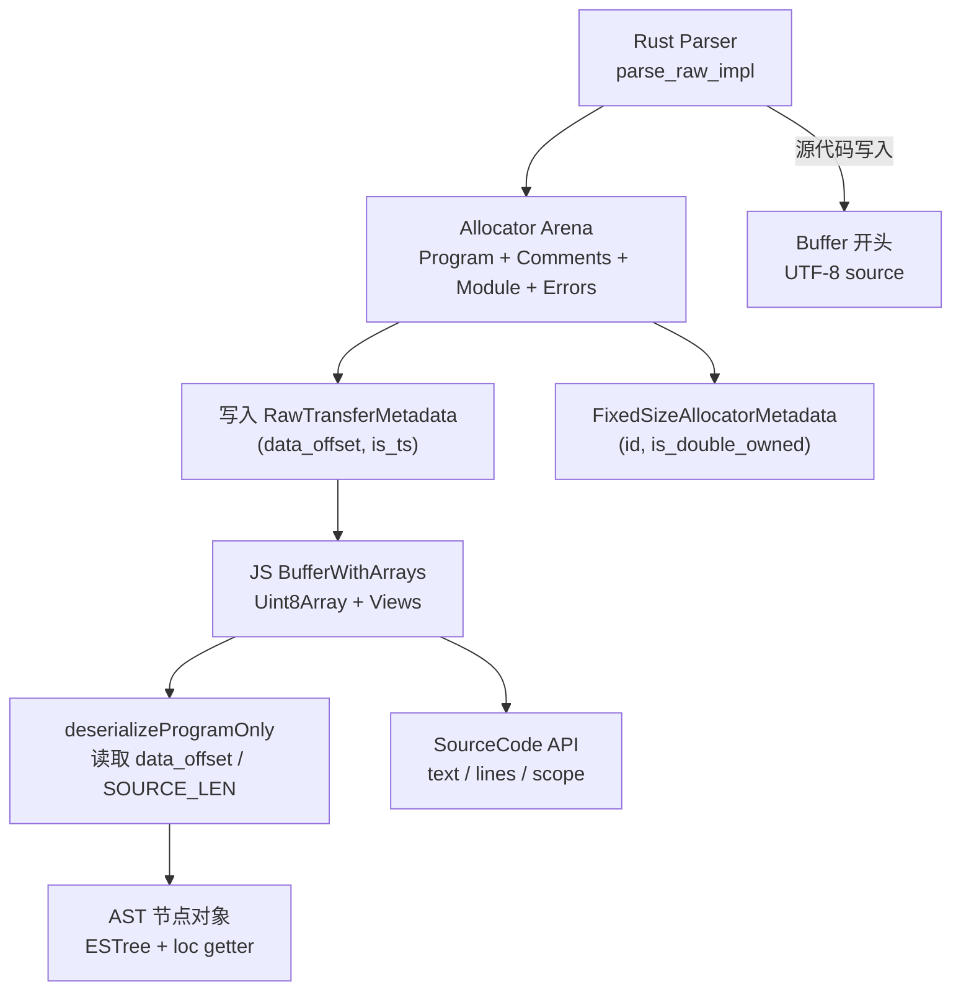

# Raw Transfer 内存 & 生成流程

## Rust → JS 缓冲结构

| 区域顺序 | 内容 | 说明 |
| --- | --- | --- |
| 1 | UTF-8 源代码 | `RawTransferFileSystem`/解析阶段写到缓冲起始，`SOURCE_LEN_OFFSET` 记录长度 |
| 2 | 对齐填充 | 16 字节对齐，保证 arena 指针满足 bump allocator 要求 |
| 3 | `RawTransferData` | 实际 AST/注释/模块/错误对象图，布局与 `napi/parser/src/raw_transfer_types.rs` 中定义一致 |
| 4 | `RawTransferMetadata` | `{ data_offset: u32, is_ts: bool }`，位于 `BUFFER_SIZE - 16` 处，JS 用 `DATA_POINTER_POS_32` 读取 |
| 5 | `FixedSizeAllocatorMetadata` | `{ id, is_double_owned }` 等信息，位于 metadata 之后，用于 Rust 跟踪缓冲是否发送到 JS |

## 自动生成管线

| 阶段 | 输入 | 输出/作用 |
| --- | --- | --- |
| Schema 收集 | `#[ast]` 宏描述的 `RawTransferData`、`Program` 等类型 | `tasks/ast_tools` 获取字段顺序、偏移、枚举 discriminant |
| RawTransferGenerator | Schema + Codegen 模板 | 生成 `apps/oxlint/src-js/generated/deserialize.js`、`constants.ts`、Rust 常量文件 |
| Rust 编译 | 生成的 `raw_transfer_constants.rs` | 确保 `parse_raw_impl` 写入偏移与 JS 常量保持一致 |
| JS 打包 | `deserialize.js`/`constants.ts` 被 `tsdown` 引入 | `source_code.ts`、`lint.ts` 调用生成代码从共享缓冲构造 AST |
