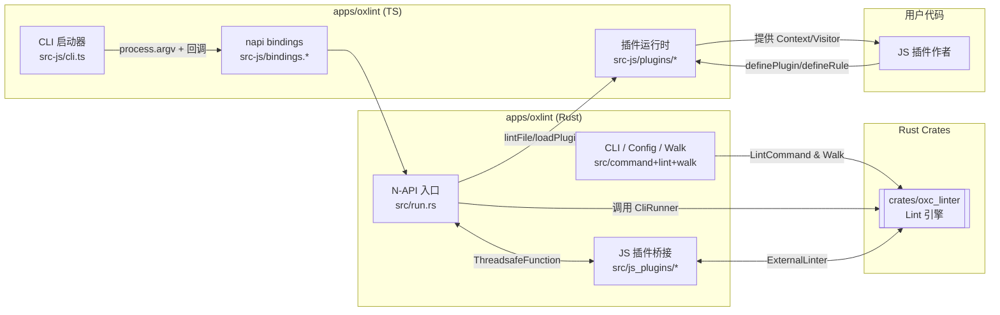

# Oxlint 结构图

## 说明
- **crates/oxc_linter**：核心 lint 引擎，负责解析配置、运行规则、合成诊断。
- **apps/oxlint/src**：Rust 应用层，提供 CLI、N-API 绑定及 JS 插件桥接逻辑，最终驱动 `oxc_linter::Linter`。
- **apps/oxlint/src-js**：Node 侧运行时，实现 CLI 入口、napi 绑定加载、JS 插件上下文与 AST 访问。
- **用户插件**：通过 `definePlugin/defineRule` API 接入，被 Oxlint 在运行期加载并执行。
